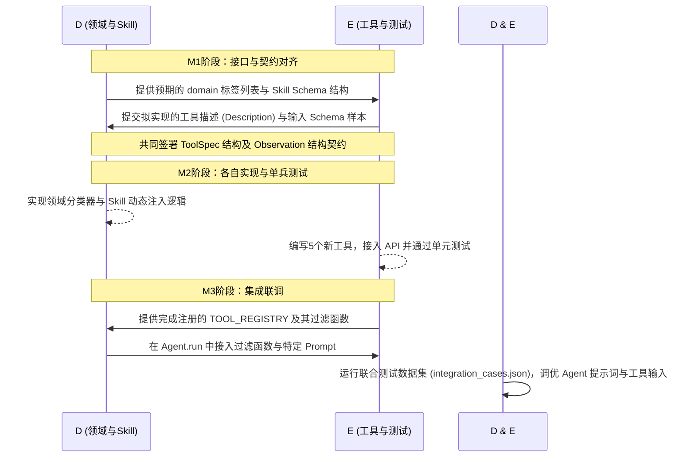

# 迭代三：Member D 与 Member E 开发与协作设计规范

> **项目名称**：基于 Agent 的文本可行度评估插件  
> **适用阶段**：迭代三（改进与项目产品化）  
> **对接人员**：Member D（领域与 Skill 负责人） & Member E（工具与测试负责人）  
> **文档状态**：草案 / 待评审对齐  

---

## 目录
1. [引言与协作背景](#1-引言与协作背景)
2. [Member D 详细开发内容（领域与 Skill 路由）](#2-member-d-详细开发内容领域与-skill-路由)
3. [Member E 详细开发内容（工具实现与测试自动化）](#3-member-e-详细开发内容工具实现与测试自动化)
4. [D 与 E 的协作协议与交互设计（核心对接点）](#4-d-与-e-的协作协议与交互设计核心对接点)
5. [工具的异常降级与产品化鲁棒性设计](#5-工具的异常降级与产品化鲁棒性设计)
6. [测试与集成验证规范](#6-测试与集成验证规范)
7. [里程碑与联合调试时序](#7-里程碑与联合调试时序)

---

## 1. 引言与协作背景

在迭代三中，项目从“通用型单 Agent 核查”转向“领域化、产品化深度核查”。为了解决通用大模型在面对专业领域（如医学健康、金融数据）时出现的幻觉与知识盲区，系统引入了**领域路由（Domain Routing）**与**专业 Skill 注入**。

- **Member D** 的核心任务是识别文章领域、缩减段落范围，并为 Agent 匹配最合适的 Skill（包括注入专属 Prompt 和约束输出格式）。
- **Member E** 的核心任务是提供高可信度的新增领域工具，并对全链路进行稳定性测试与性能评估。
- **协作冲突点**：如果 D 在设计路由时不知道 E 有哪些工具，或者 E 实现的工具输出格式不符合 D 路由后 Agent 的消费预期，就会导致 ReAct 循环失效。因此，制定本《开发与协作设计规范》以锁定双方职责和数据边界。

---

## 2. Member D 详细开发内容（领域与 Skill 路由）

Member D 负责“数据流入 -> 领域识别 -> 范围缩减 -> Skill 匹配”的管道设计。其开发重点包含以下几个模块：

### 2.1 领域分类器（Domain Classifier）
在网页正文经预处理后，D 需要在 `agent/agent/domain/` 目录下开发领域识别模块。
- **输入**：预处理后的文章全文或可疑段落。
- **技术选型**：调用轻量级 LLM 客户端（如 GLM）进行快速分类，或使用规则匹配。
- **输出标签**：
  - `medical`（医学健康、养生、医药、临床实验）
  - `finance`（财经新闻、宏观经济、公司财报、股票行情）
  - `technology`（学术科研、科技前沿、科普、发明专利）
  - `news_policy`（时政新闻、政策法规、社会突发事件）
  - `general`（通用常识、其他无法明确分类的文本）

### 2.2 范围缩减器（Paragraph/Claim Filter）
并非文章中的所有句子都需要送入高强度的 ReAct 循环中。D 需要设计过滤算法：
- 结合领域标签，只提取对该领域“有核查价值”的声明。
  - *例如*：在 `medical` 领域中，优先过滤并保留带有药物名称、病症疗效、百分比疗效的句子；在 `finance` 领域中，优先提取含有具体数字、增长率、货币单位的句子。
- 过滤无关段落（如广告、免责声明、导航推荐），减少不必要的 LLM Token 消耗。

### 2.3 Skill Schema 定义与数据建模
D 需要定义 `Skill` 的数据结构。一个 Skill 应具备以下字段：

```python
# 推荐定义在 agent/agent/skills/schema.py 中
from pydantic import BaseModel

class SkillSchema(BaseModel):
    skill_name: str                 # 技能名称，例如 "MedicalClaimVerification"
    domain: str                     # 适用领域，对应分类器的标签
    system_prompt_patch: str        # 注入给该领域 Agent 的增强系统提示词
    allowed_tools: list[str]        # 限制该 Skill 只能调用的工具名称列表
    claim_filter_rules: dict        # 针对该领域声明的过滤和加权规则
    output_contract: str            # 输出格式约束说明（如特定的置信度计算公式）
```

### 2.4 Skill 存储与注入逻辑
- **加载机制**：设计本地 JSON 配置文件或由 B 存储在 SQLite 中。
- **注入逻辑**：在 agent.py 启动验证前，D 需要将当前被激活的 Skill 数据合并到 Agent 的 `system_prompt` 中，动态改变 Agent 识别错误和调用工具的行为。

---

## 3. Member E 详细开发内容（工具实现与测试自动化）

Member E 负责实现满足产品化稳定性要求的新工具，并建立自动化回归测试。其开发重点包含以下模块：

### 3.1 5 个核心新增工具开发
E 需要在 `agent/agent/tools/` 下新建相应的 Python 文件并实现核心逻辑：

1.  **`wikidata_lookup`** (对应文件：`wikidata_lookup.py`)
    *   **职责**：检索结构化实体事实（如某公司何时成立、某人国籍、地理位置等）。
    *   **实现**：使用 `httpx` 调用 Wikidata API，如果可以，通过 SPARQL 节点查询，对结果进行结构化提取。
2.  **`official_statistics_lookup`** (对应文件：`official_statistics.py`)
    *   **职责**：验证宏观经济与社会数字。
    *   **实现**：提供对世界银行数据 API 或本地国家统计局精简指标库的查询，接受“指标名称+年份+国家”作为查询参数。
3.  **`pubmed_search`** (对应文件：`pubmed_search.py`)
    *   **职责**：针对医学与健康问题提供顶级文献支撑。
    *   **实现**：调用 NCBI eutils 的 `esearch` 与 `esummary` 接口，提取文章标题、期刊、发表年、摘要内容。
4.  **`semantic_scholar_search`** (对应文件：`academic_search.py`)
    *   **职责**：核对学术界和前沿科技的宣称（如“Nature 发表的某论文说……”）。
    *   **实现**：调用 Semantic Scholar API 搜索文献，返回被引量、摘要、领域分类。
5.  **`fact_check_registry`** (对应文件：`fact_check.py`，替代原 `news_archive_search` 的部分逻辑)
    *   **职责**：直接查询已知谣言的辟谣结论。
    *   **实现**：对接 Google Fact Check Tools API，返回已知的核查状态（True/False/Misleading）以及核查媒体。

### 3.2 工具注册表与描述项打磨
E 需要在 registry.py 中完成上述工具的注册：
- 编写详尽且严谨的 `description`。由于 Agent 通过语义描述选取工具，E 必须说明：**什么时候应该用这个工具，它的输入格式是什么，以及它能产出什么。**

---

## 4. D 与 E 的协作协议与交互设计（核心对接点）

为确保两个模块能无缝咬合，D 与 E 的接口需遵循以下协议设计：

### 协议一：动态工具可见性过滤（D 决策，E 提供）
Agent 核心在组装 System Prompt 时，只向 LLM 声明当前 Skill 允许使用的工具。
- **开发配合**：
  - E 在注册工具时，需在 `ToolSpec` 中扩展适用领域字段 `domains`；
  - D 在匹配完领域并选取 Skill 后，调用 E 提供的过滤函数，动态裁剪 `TOOL_REGISTRY`，生成当前 ReAct 步骤中仅可见的工具子集。

```python
# 双方同意的 registry.py 接口设计
from typing import Callable, List
from pydantic import BaseModel

class ToolSpec(BaseModel):
    name: str
    description: str
    input_schema: dict
    func: Callable          # async def func(input: str) -> str
    domains: List[str]      # 协作点：E 声明此工具适用于哪些领域，如 ["medical", "general"]

# E 实现该函数，D 在 agent.py 组装 prompt 时调用
def get_allowed_tools(active_domains: List[str]) -> List[ToolSpec]:
    """返回符合当前被激活领域（或通用 general 领域）的所有工具描述"""
    return [
        spec for spec in TOOL_REGISTRY.values()
        if any(d in active_domains for d in spec.domains) or "general" in spec.domains
    ]
```

### 协议二：面向 Agent 辩论的结构化 Observation 协议
普通的工具只返回一堆网页正文，这会导致 Challenger Agent 与 Verifier Agent 在辩论时各说各话、抓不住重点。
- **开发配合**：
  - E 必须在工具返回值中，强制将外部信息格式化为包含“元数据、可信度、时间、核心证据”的结构化字符串；
  - D 根据这一格式，在 Skill Prompt 中引导 Agent 去重点辨析证据的“发表年份”和“可信度”。

**统一 Observation 结构示例（字符串格式）：**
```text
[SOURCE]: PubMed API
[TITLE]: Association of Vitamin D Supplementation With Cardiovascular Disease Risk
[YEAR]: 2023
[CREDIBILITY]: High (Systematic Review & Meta-Analysis)
[EVIDENCE]: The study concluded that vitamin D supplementation does not reduce the risk of major adverse cardiovascular events (hazard ratio 0.97, 95% CI 0.92-1.02).
```

---

## 5. 工具的异常降级与产品化鲁棒性设计

工具在网络波动、API 频控、请求超限时的表现直接决定了插件是否能正常使用。E 在实现工具时，需遵循以下异常降级与鲁棒性设计规范：

### 5.1 降级策略（Fallback Matrix）
| 工具 | 首选数据源 | 降级机制 1 | 降级机制 2 |
| :--- | :--- | :--- | :--- |
| `wikidata_lookup` | Wikidata SPARQL | Wikipedia Lookup | 通用 `web_search` |
| `pubmed_search` | NCBI E-utils API | Semantic Scholar | 通用 `web_search` |
| `official_statistics` | World Bank API | 本地预制指标库 (CSV/JSON) | 通用 `web_search` |
| `fact_check_registry`| Google Fact Check API | Snopes Scraper | 提示“未在辟谣数据库中找到” |

### 5.2 代码防崩溃约束
E 必须保证所有的工具函数符合如下结构，严禁将未处理的 HTTP 异常或 JSON 解析异常抛给 Agent：

```python
# 示例：E 编写 pubmed_search 的防崩溃范式
async def pubmed_search(input: str) -> str:
    try:
        # 1. 网络请求逻辑
        response = await httpx.get(PUBMED_API_URL, params={"term": input}, timeout=8.0)
        response.raise_for_status()
        
        # 2. 解析逻辑
        data = response.json()
        return format_to_structured_obs(data)
        
    except httpx.TimeoutException:
        # 超时降级，不抛出异常，而是通知 LLM 建议更换工具或使用 general 搜索
        return "警告：PubMed 检索超时。如果急需验证此文献，建议调用 web_search 搜索该文献标题。"
    except Exception as e:
        # 兜底捕获
        return f"工具执行失败：PubMed 服务暂时不可用 ({str(e)})。建议换用 web_search 检索。"
```

---

## 6. 测试与集成验证规范

作为**测试负责人**，E 需要为 D 路由后的工具调用链路，设计严格的测试方案。

### 6.1 单元测试（Unit Tests）
在 `agent/tests/` 目录下，E 应针对每个工具编写对应的测试用例（如 `test_pubmed.py`, `test_wikidata.py`）。
- **要求**：
  - 测试正常返回结构；
  - 测试异常网络条件下的 Fallback 表现（使用 `unittest.mock` 模拟 HTTP 500/Timeout）。

### 6.2 D-E 集成调试与联合测试
当 D 完成领域分类与 Skill 注入，E 完成工具开发后，双方需要通过构建**联合测试数据集**来进行闭环测试。

**联合测试案例配置（例如存储在 `tests/integration_cases.json`）：**
```json
[
  {
    "case_id": "test_med_001",
    "article_segment": "最新研究显示，每日服用维生素C可以根治各类恶性肿瘤。",
    "expected_domain": "medical",
    "expected_skill": "MedicalVerificationSkill",
    "must_trigger_tools": ["pubmed_search"],
    "forbidden_tools": ["official_statistics_lookup"]
  },
  {
    "case_id": "test_fin_001",
    "article_segment": "根据世界银行公布的数据，2023年全球GDP实际增长率高达 12.5%。",
    "expected_domain": "finance",
    "expected_skill": "FinanceVerificationSkill",
    "must_trigger_tools": ["official_statistics_lookup"],
    "expected_verdict": "factual_error"
  }
]
```

D 与 E 需共同运行联调脚本，断言：
1. `expected_domain` 与 `expected_skill` 路由正确；
2. Agent 在 ReAct 循环中正确触发了 `must_trigger_tools` 中的工具；
3. 工具返回了格式正确的 Observation，且 Agent 成功解析并给出了最终的 `AnnotationEvent`。

---

## 7. 里程碑与联合调试时序

根据甘特图规划，D 与 E 的协作开发应按如下生命周期有序推进：



### 里程碑完成度核验表：
- [ ] **M1 结束时**：`ToolSpec` 新增字段达成一致，双方在 Wiki/设计文档上签字，接口冻结。
- [ ] **M2 结束时**：E 实现的 5 个新工具通过本地单元测试，能稳定返回结构化 Observation 文本。
- [ ] **M3 结束时**：集成联调通过，在 `medical` 文章中只会触发医学类工具，并且 Agent 能根据结构化论据在辩论中得出正确结论。
